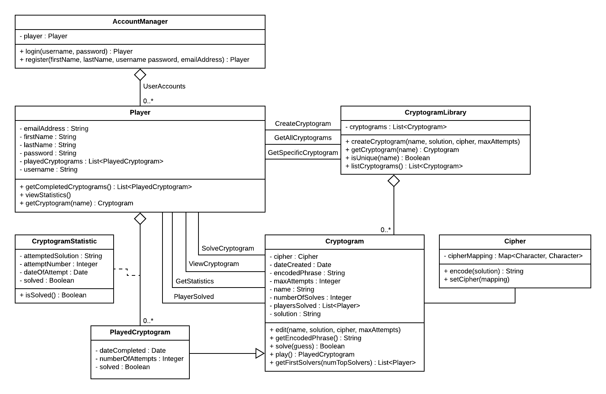

## Design 1 - Frank Olszewski

##### Pros  
1. All necessary classes are present in the UML class design
2. All necessary relationships are shown in the UML class design
3. Most attributes related to the class are listed
Most operations related to the classes are listed
4. Proper UML class diagram notation was used
5. Utilizing a “CryptogramLibrary” class to be a data access layer, allowing the system to check for uniqueness of a Cryptogram name, was a good decision

##### Cons
1. The team suggested to use a Cipher class to replace the KeyValuePair class
2. In order to associate the Cryptogram with the player, a subclass of the Cryptogram class was used (PlayedCryptogram) which was stored in a List attribute inside of the Player instance.  This could work but it is not the most intuitive design to create a link between the Cryptogram and the Player.  The team decided to adopt another design.

## Design 2 - Jason Sanchez

##### Pros
1. Simple Design
2. Application class representation of the methods found in the user interface
3. Does not represent an actor "user"
4. Uses a class for Cipher with only an encode method
Has a class that represents completed cryptograms where wasSolved is a Boolean.

##### Cons
1. Does not show any associations other than player creates cryptogram
2. Over Simplified and under engineered
3. The association arrow is drawn incorrectly with an arrow head in the middle
4. During a new install my dotted line for player and cryptogram does not make sense
5. Was not clear at first this was a multi-user application until I described the use of allUnsolovedCryptograms
6. Does not think of UML diagram as the application

## Design- 3 Joleon Pettway(gth781s)

##### Pros
1. Simple
2. Captures player attempts in a CryptogramAttempt class
3. Defines a Cipher class for logic for encoding the secret phrase

##### Cons
1. No need for a decode operation in the Cipher class
2. No need to define the User actor as a class

## Design 4 (Li Chen)

##### Pros
1. Most classes are present in the UML class diagram.
2. Most attributes related to the classes are listed
3. Most operations related to the classes are listed.

##### Cons
1. The UML class design needs a cypher class
2. The UML class design needs a class to manage user registration and login
3. It is a little bit over-engineering to create two additional classes to capture the cryptogram list concept. There is also no need to create subclass unsolved cryptogram and solved cryptogram.
4. Should expose the setName, setSolution,etc methods in the Cryptogram class.

##  Team Design

Each team member had varying ways of approaching the assignment on an individual level, but once we shared our results it was clear that we were on the same page on the overall design.
In the team-design, we have the following seven classes:  
**AccountManager:** This function of this class is to register users and login players. In the personal designs, we used a generic User class to perform the similar functions. During team discussion, we think it is best not to represent an actor in a class and decided to use the AccountManager concept, allowing a single actor of the system to have multiple accounts.  
**Player:** The need for this class is obvious and each individual design has this class. The team reach a consensus on this class without too much discussion.  
**CryptogramLibrary:**  The idea to come up with a cryptogram library is mainly derived from individual design 1. The class is used to contain all the cryptograms in the system and to guarantee the unique name when a new cryptogram is created. When Frank proposed this idea, the team bought into it and implemented in the team-design.  
**Cryptogram:** The need for this class is obvious and each individual design has this class. The team reach a consensus on this class without too much discussion.  
**PlayedCryptogram:** When team was considering how to represent the interaction between Player and the Cryptogram, we all agree a separate class is needed to. This class is implemented in each individual design with different name. However the team discussed for a long time how to define this class relationship with Cryptogram class. It can be either a composition or aggregation relationship with Cryptogram class, all depending all different implementing strategy. After discussion, the team chose to make this class to have composition relationship with Cyrptogram class. In summary, this class is to describe each play attempt that a Player may have in relation to a Cryptogram instance, housing play-specific details such as the date it was completed, if the Cryptogram was solved at that point and which attempt number it was.      
**CryptogramStatistic:** This class is to capture the statistic of the player attempts wit certain cryptogram class. It provide key metrics such as the attempt number, date of the attempt,etc. Player class call this class to get key metrics for each player. It class is common among all the individual designs and team reach an consensus quickly.     
**Cipher:** Another common class that many of the team members used was a Cipher class - this was determined to be a good way to meet object-oriented design standards, specifically single responsibility principle (SRP).  The Cryptogram class should offload the encoding of the solution to a separate class to allow further scaling and unit maintainability for easy revisions.  

##  Summary
Throughout the discussion, every team member came to the group with different strengths and was able to express their decision-making process behind their designs.  When it came to overall design, most team members came with similar structures in a few places while still showing variances in overall approach.  While we quickly adopted the commonalities between our designs(i.e. A class that captures cryptogram attempts and a class to represent the cipher logic of a cryptogram), for the design elements that differed between our designs, we discussed their pros, cons, and thought processes that led us to make those decisions. Through this discussion we got a glimpse at how each of us interpreted the requirements as well as our individual understandings around UML and software development. The discussion ultimately led us to come to a consensus on the design elements that we wanted to incorporate into our final design.  We ultimately settled on the elements from all of our designs that met the functional requirements of the assignment and would also help ensure we meet the nonfunctional requirements once we enter the implementation phase of the project. Understanding each team member’s individual background and experiences with UML, Java, Android development and overall software development histories was key in determining how to proceed.
