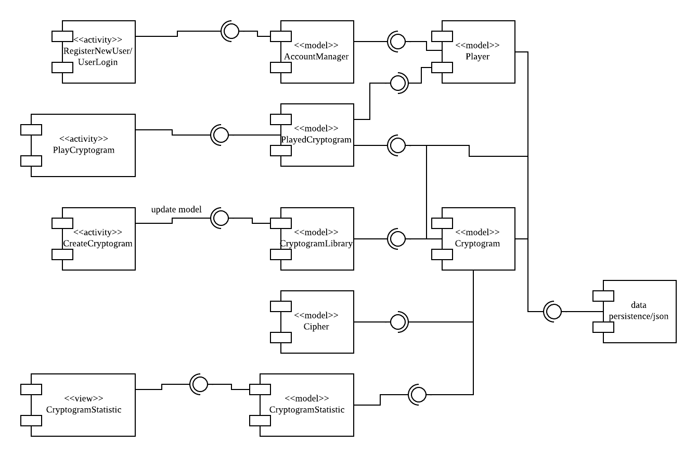
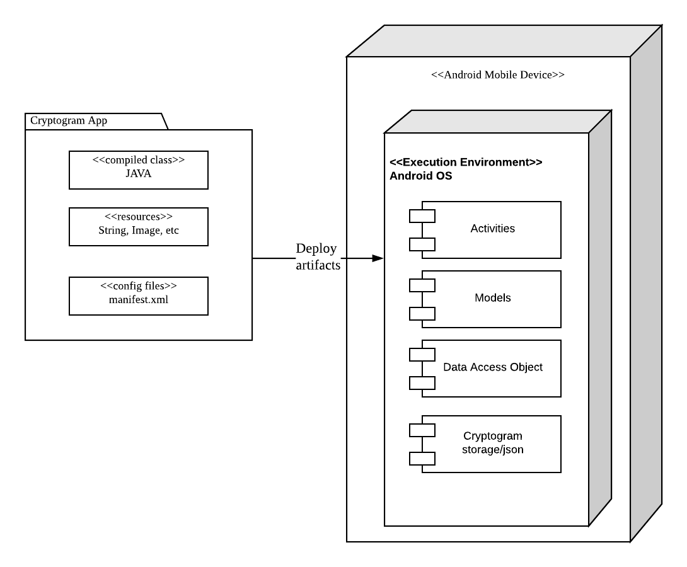
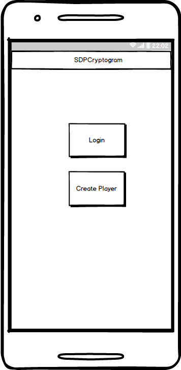
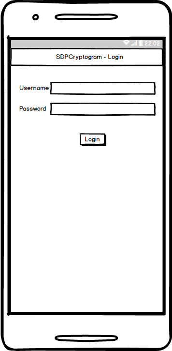
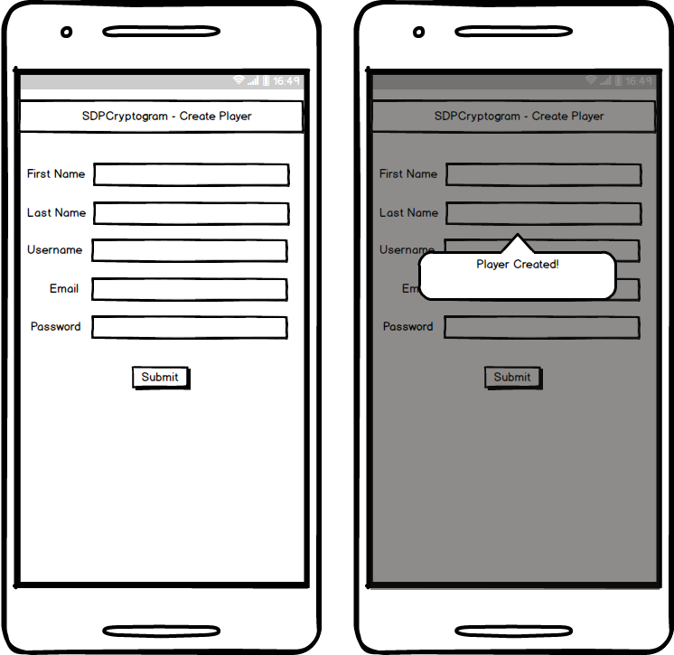
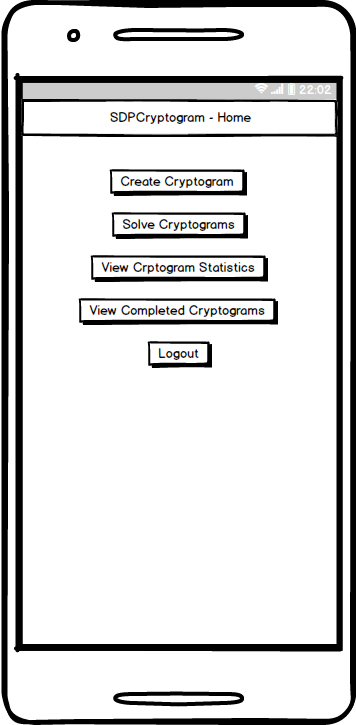
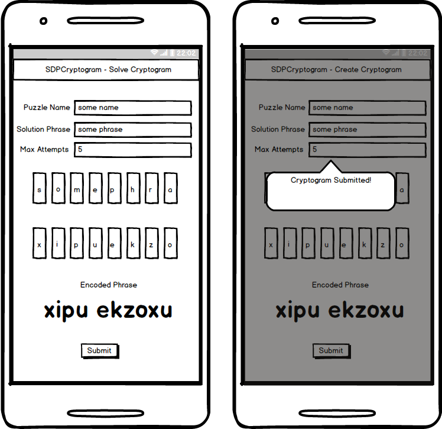
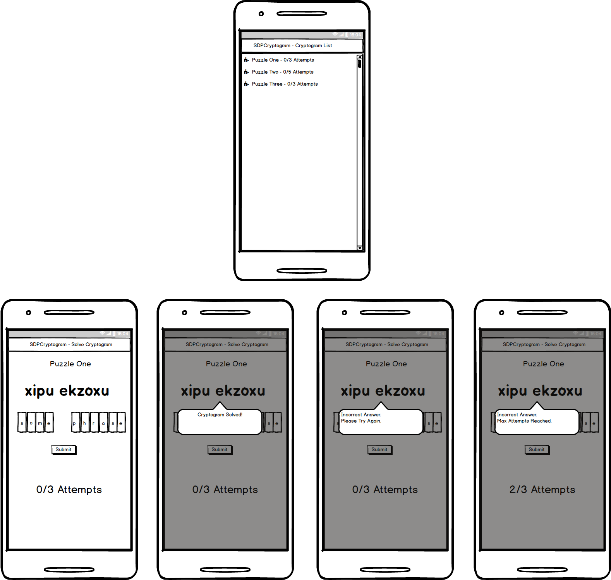
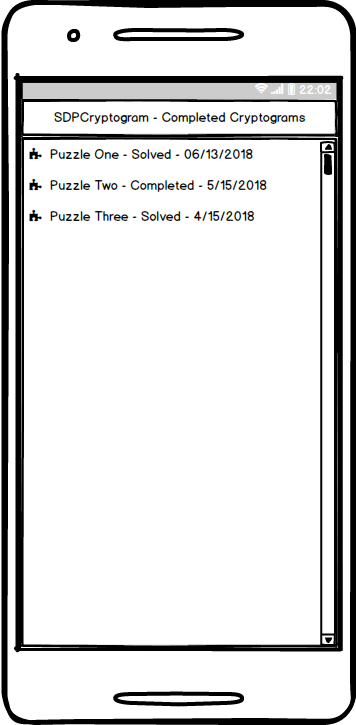
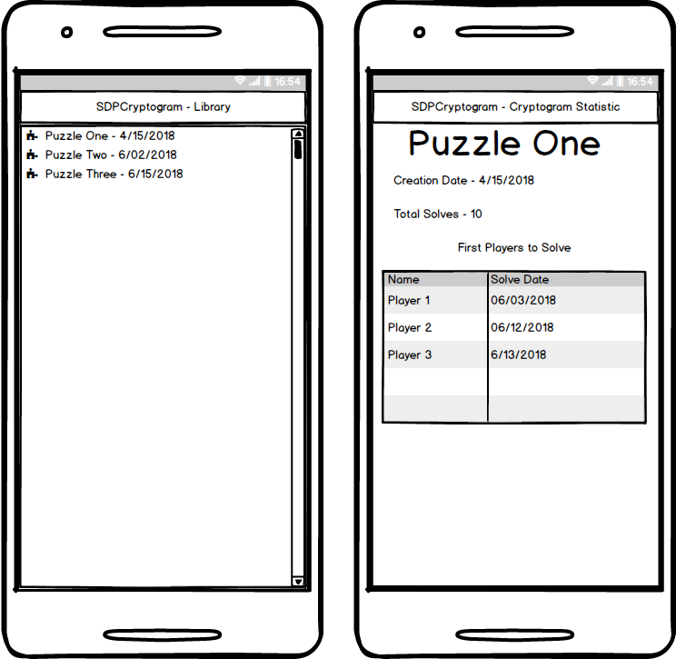

# Design Document

**Summer 2018 / Team 55**

## Version History

| Version | Author          | Description                             |
| ------- | --------------- | --------------------------------------- |
| 1.0     | Team55          | Initial version of the Design Document  |
| 1.1     | Frank Olszewski | Added Design Considerations information |
| 1.2     | Joleon Pettway  | Added UX Mockups                        |
| 1.3     | Li Chen         | Added Deployment Diagram, Component Diagram |
| 2.0     | Joleon Pettway  | Updated the UX Mockup to reflect changes in App: player creation UI and Cryptogram statistics UI|

## 1 Design Considerations

### 1.1 Assumptions

The SDPCryptogram application will only run on Android devices and will not require any external system to interface with.  The application will require a recent version of the Android operating system and will run on both phone and tablet devices.  Since no server architecture will be integrated with this system, it is assumed that a single device will be shared between multiple users so that they can play on their own time.  Examples of this are an educational environment, a public space such as a library or even a device share between family members.  

### 1.2 Constraints

Constraints that have not been described in other areas are:

* Due to the nature of the Android operating system, not every device size, make or model can be tested.  As such, the team will focus on the most widely distributed operating system versions and device sizes.
* Since there is no external server to house the cryptograms that are created by all users, an internal data structure will be utilized to hold the records.

### 1.3 System Environment

The initial build of the SDPCryptogram application will target the most recent version of Android OS and the  most common screen size and pixel density combinations.

## 2 Architectural Design

### 2.1 Component Diagram

### 2.2 Deployment Diagram

## 3 Low-Level Design

*Describe the low-level design for each of the system components identified in the previous section. For each component, you should provide details in the following UML diagrams to show its internal structure.*

### 3.1 Class Diagram

### 3.2 Other Diagrams

*<u>Optionally</u>, you can decide to describe some dynamic aspects of your system using one or more behavioral diagrams, such as sequence and state diagrams.*

## 4 User Interface Design
### 4.1 First Launch

### 4.2 Login

### 4.3 Create Player

### 4.4 Home Screen

### 4.5 Create Cryptogram

### 4.6 Solve Cryptogram

### 4.7 Completed Cryptograms

### 4.8 Cryptogram Statistics

