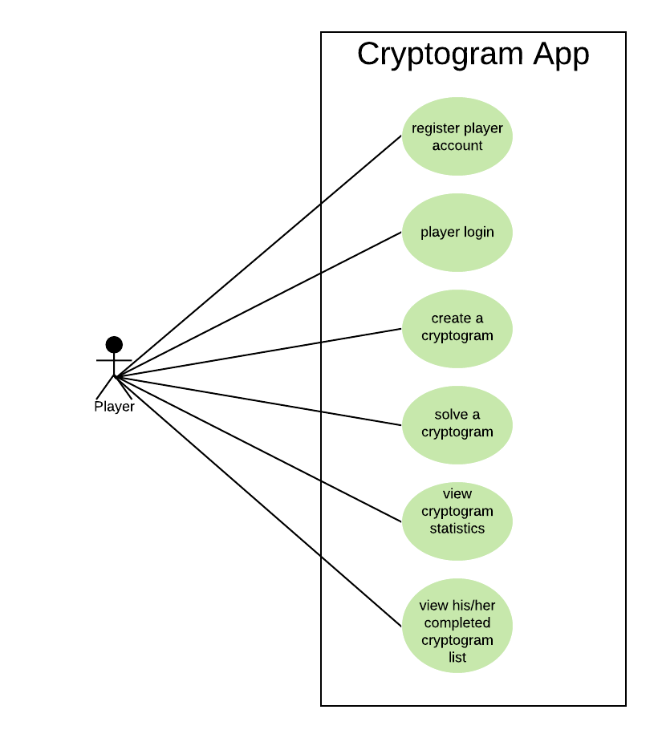

# Use Case Model

**Summer 2018 / Team 55**

## Version History

| Version | Author          | Description                                |
| ------- | --------------- | ------------------------------------------ |
| 1.0     | Li Chen         | Initial version of the use case document |

## 1 Use Case Diagram

## 2 Use Case Descriptions

##### Register Player Account
- Requirements: This should allow the user to create a player account in the App
- Pre-conditions: There is create account UI
- Post-conditions: A player account is created and its profile is persisted in the system.  
- Scenario:
  - User opens ReigsterPlayer UI
  - User enters first name
  - User enters last name
  - User enters unique username
  - User enters email address
  - User submit the registration info
  - A player is registered in the system

##### Login in The App
- Requirements: This should allow the user to login with his/her player account
- Pre-conditions: The user has already registered an account in the App
- Post-conditions: A user logins the app  
- Scenario:
  - User opens login UI
  - User enters username
  - User enters password (optional)
  - User submits the login information
  - User logins successfully into the App

##### Create A Cryptogram
- Requirements: This should allow the player to create a cryptogram
- Pre-conditions: The user has already login into the App
- Post-conditions: A cryptogram is created
- Scenario:
  - Player opens CryptogramLibrary UI
  - Player clicks on add button
  - Player enters a unique cryptogram puzzle name
  - Player enters a solution phrase
  - Player choose a cipher
  - Player set the max number of allowed solution attempts
  - Player edits the above steps as necessary
  - Player saves the cryptogram
  - Player views the confirmation message

##### Solve A Cryptogram
- Requirements: This should allow the player to attempt to solve a cryptogram and user can quit solving at any point.
- Pre-conditions: The user has already login into the App and there are unsolved cryptograms in the App
- Post-conditions: return to the list of unsolved cryptogram
- Scenario 1:
  - Player chooses a cryptogram from a list of all unsolved cryptogram
  - Player views the chosen cryptogram and number of incorrect solution submissions
  - Player matches the replacement and encrypted letters together, and view the resulting potential solution
  - Player submits the answer
  - Player get a result indicating that the solution was successful
  - The cryptogram moves to the completed list

- Scenario 2:
  - Player chooses a cryptogram from a list of all unsolved cryptogram
  - Player views the chosen cryptogram and number of incorrect solution submissions
  - Player matches the replacement and encrypted letters together, and view the resulting potential solution
  - Player submits the answer
  - the number of the submission is smaller than the max solution attempts
  - Player get a result indicating that the solution was unsuccessful

- Scenario 3:
  - Player chooses a cryptogram from a list of all unsolved cryptogram
  - Player views the chosen cryptogram and number of incorrect solution submissions
  - Player matches the replacement and encrypted letters together, and view the resulting potential solution
  - Player submits the answer
  - the number of the submission is equal to the max solution attempts
  - Player get a result indicating that the solution was unsuccessful
  - The cryptogram moves to the completed list

##### View Completed Cryptogram List
- Requirements: This should allow the player to see which cryptograms are completed by him/her, which are solved and the date it was solved.
- Pre-conditions: The user has already login into the App
- Post-conditions: None
- Scenario:
  - Player clicks on view completed list button
  - Player views the names of the completed cryptograms
  - Player views the solved/unsolved status and completed date of the cryptogram

##### View Cryptogram Statistics
- Requirements: This should allow the player to see the complete list of the cryptograms ordered by creation date. The player will also see the number of players who have solved the cryptogram, and the username of the first three players to solve the cryptogram.
- Pre-conditions: The player has already login into the App
- Post-conditions: None
- Scenario:
  - Player clicks on view cryptogram library button
  - Player views the list of cryptograms ordered by creation date
  - Player chooses a cryptogram
  - Player views the number of the players who have solved the cryptograms
  - Player views the first three players who solved the cryptogram.
