# User Manual

**Summer 2018 / Team 55**

## Version History

| Version | Author          | Description                         |
| ------- | --------------- | ----------------------------------- |
| 1.0     | Jason Sanchez   | Initial version of the user manual  |
| 2.0     | Jason Sanchez   | Updated screenshots of latest build |
| 2.1     | Frank Olszewski | Removed (optional) from password    |
| 3.0     | Jason Sanchez   | Updated for final version of app    |

### Introduction

SDPCryptogram is a Cryptogram Puzzle application for Android.  The application will let users create and solve cryptogram puzzles.  The application also provides cryptogram statistics.  Have fun!

Wikipedia defines a Cryptogram as 
  >a type of puzzle that consists of a short piece of encrypted text. Generally the cipher used to encrypt the text is simple enough that the cryptogram can be solved by hand. Frequently used are substitution ciphers where each letter is replaced by a different letter or number. To solve the puzzle, one must recover the original lettering.

### Minimum Hardware Requirements

- **Operating System**: Android 6.0 and higher
- **Screen Resolution**: 480x800

##### Register Player Account

  - Create a new player account by clicking **CREATE PLAYER** from the launch screen

     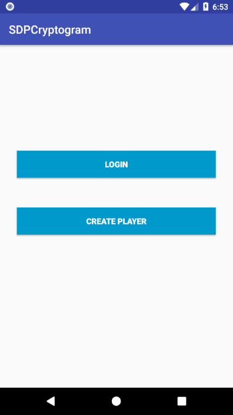

  - In the Create Player window enter the player information and click the **Submit** button
     
    - First Name
    - Last Name
    - Email
    - Username
    - Password

     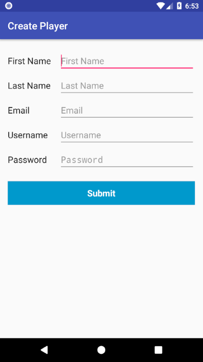

##### Login To The App

  - In the Login window enter the player's username and password and click the **Login** button

    - Username
    - Password

     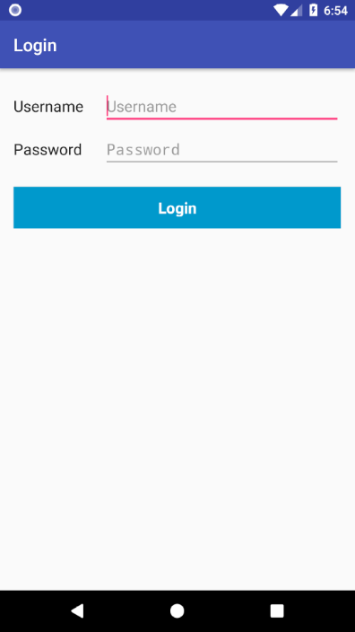

##### SDPCryptogram Home Menu

 - From the home menu you can 

  1. [Create a cryptogram](#create-a-cryptogram)
  2. [Solve a cryptograms](#solve-a-cryptogram)
  3. [View cryptogram statistics](#view-cryptogram-statistics)
  4. [View completed cryptograms](#view-completed-cryptogram-list)
  5. [Logout](#logout)

  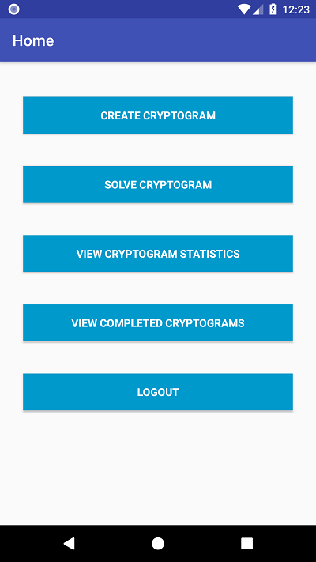

##### Create A Cryptogram

 - To create a cryptogram
   - Enter a unique cryptogram puzzle name

    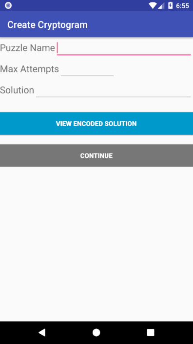
   
   - Enter a maximum number of allowed solution attempts
   - Enter a solution phrase
   - The application will automatically display the letters needed for encoding and will automatically remove letters which are in the solution phrase more than once, digits, spaces, and special characters.  

    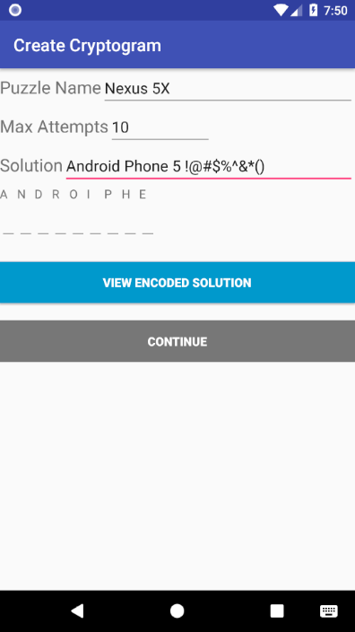

   - Choose different letters to pair with every letter present in the phrase

    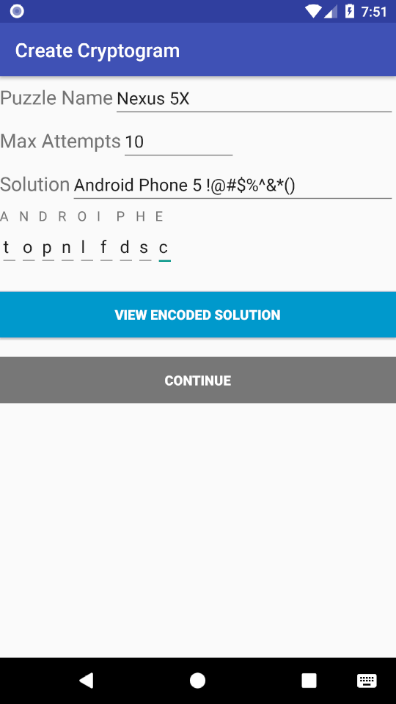

   - To view the encoded solution click **VIEW ENCODED SOLUTION**

    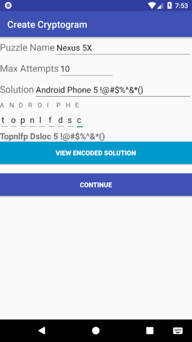

   - Click **Continue** to save the cryptogram
  
   

##### Solve A Cryptogram

  - To Solve a cryptogram 
    - Choose a cryptogram from the cryptogram library of all unsolved cryptograms
    - Click **PLAY CRYPTOGRAM**

      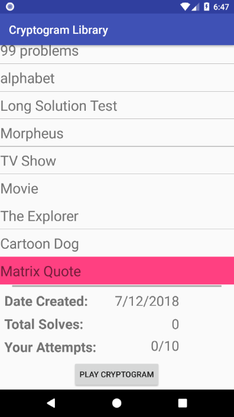
  
    - Match the replacement and encoded letters together.  The application will automatically populate repeated letters found in the encoded phrase.

      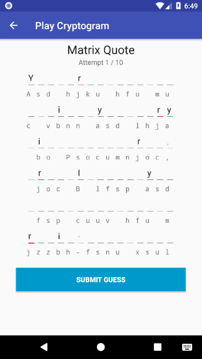

    - When satisfied with the potential solution, click the **SUBMIT GUESS** button
    - If the potential solution is successful the app will display successful
      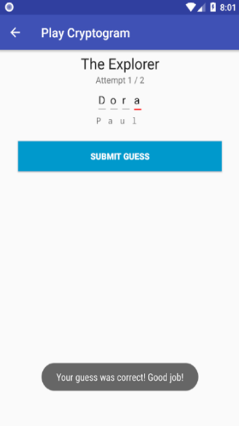
    - If the potential solution is unsuccessful the app will increment the player's attempts
    - If the player's attempts increases to the maximum allowed attempts the cryptogram puzzle is lost
    - At any point, the player may return to the list of unsolved cryptograms to try another

##### View Cryptogram Statistics

  - To view a cryptogram's statistics select a cryptogram from the Cryptogram Library

     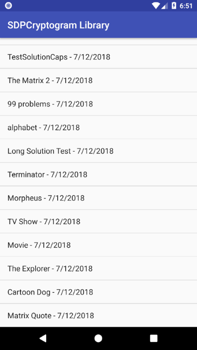

  - Cryptogram Statistics
    - The date the cryptogram was created
    - The number of players who have solved the cryptogram
    - The username of the first three players to solve the cryptogram

     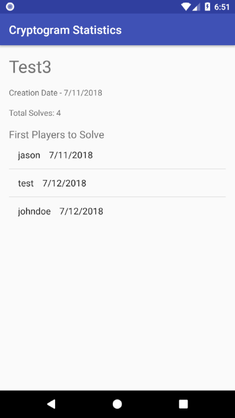

##### View Completed Cryptograms List

  - The list of completed cryptograms for that player will show the cryptogram’s name, whether it was successfully solved, and the date it was completed

       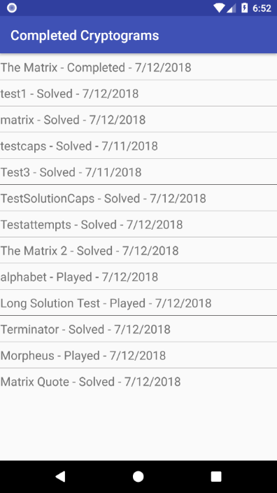

##### Logout

  - To Logout click the Logout button on the home menu.  Logging out will bring the user back to the launch screen
